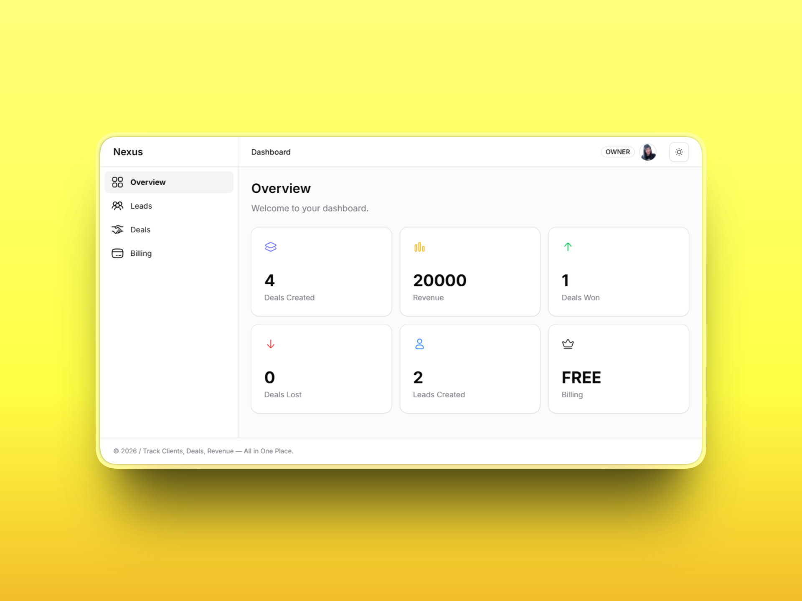
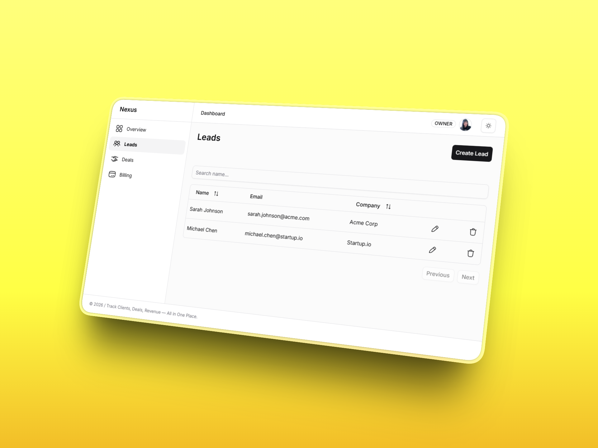
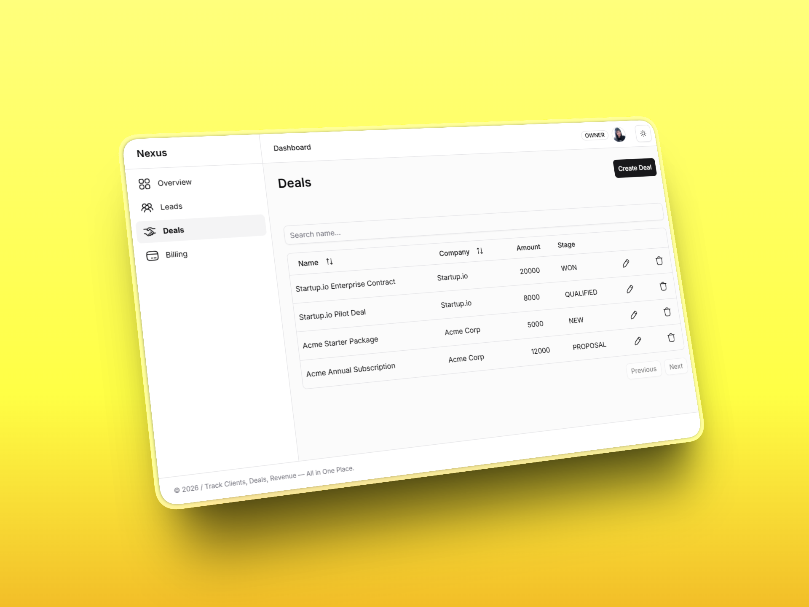
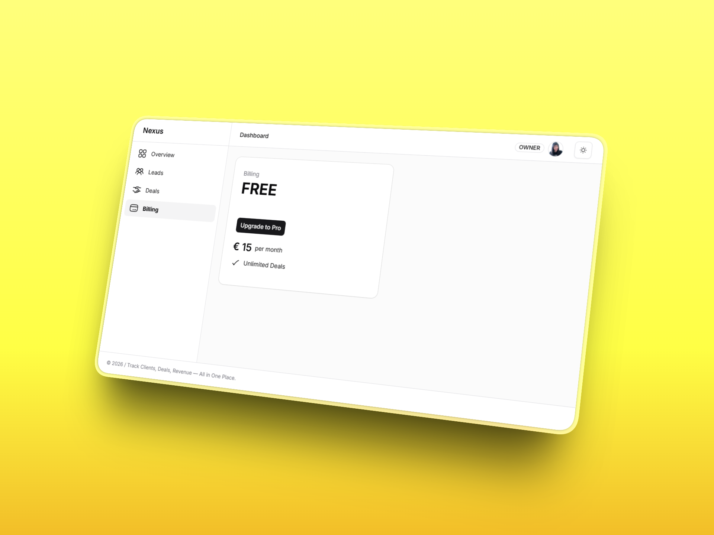

# Client Tracker 


Client Tracker is a CRM-style application designed for freelancers and small consultancies to track leads, deals and revenue in one place.

## Table of Contents


- [Preview](#preview)
- [Features](#features)
- [Tech Stack](#tech-stack)
- [Role-Based Access Control](#role-based-access-control)
- [Billing](#billing)
- [Analytics](#analytics)
- [Running Locally](#running-locally)
- [Contributions](#contributions)
- [License](#license)


# Preview

<p align="center">
  
  
</p>

<p align="center">
  
  
</p>

# Features

- CRUD operations to create, view, edit and delete leads and deals  
- Authentication and role-based access control (RBAC) 
- Data aggregation and analytics
- Subscription billing with Stripe


# Tech Stack

## Frontend

- Next.js (App Router)
- React + TypeScript
- Tailwind CSS
- shadcn/ui


## Backend / Infrastructure

- Next.js Server Components & API Routes
- Prisma ORM
- PostgreSQL (Neon)
- NextAuth (OAuth)
- Stripe (Test Mode Billing)

---

# Role-Based Access Control

The application implements two roles:

## OWNER

- Full access to all CRUD operations
- Can view analytics
- Can manage billing and subscriptions

## VIEWER

- Read-only access to leads and deals
- Can view analytics
- Cannot modify data
- Cannot manage billing

## Permission Matrix

| Action | Owner | Viewer |
|------|------|------|
| View leads | ✅ | ✅ |
| Create/edit leads | ✅ | ❌ |
| View deals | ✅ | ✅ |
| Create/edit deals | ✅ | ❌ |
| View analytics | ✅ | ✅ |
| Manage billing | ✅ | ❌ |


# Billing 

Billing is implemented using **Stripe (test mode)**.

## Plans

**Free** — limited number of deals  
**Pro** — unlimited deals

## Enforcement Rules

- Deals limit is enforced at creation time
- Existing deals can always be viewed
- Billing actions are restricted to **Owners**

# Analytics 

The dashboard provides aggregated insights:

- Total leads created
- Total deals created
- Deals won vs lost
- Total Revenue


Analytics are computed server-side using database aggregation queries to ensure accuracy and consistency.

---

# Running Locally

1. Clone the repository and install dependencies
```bash

   git clone https://github.com/dnmore/client-tracker.git
   cd client-tracker

   ```
2. Install dependencies
```bash

   pnpm install

   ```
3. Create `.env` file in the project root and configure environment variables (OAuth, database, Stripe test keys)

4. Run database migrations

```bash

   pnpm prisma migrate dev

   ```

5. Start the development server

```bash

   pnpm dev

   ```

   The application will be available at:

   ```

   http://localhost:3000

   ```
# Contributions

Contributions are welcome!

1. Fork the repository.
2. Create a new branch (`feature/your-feature-name`).
3. Commit changes with clear messages.
4. Submit a pull request.

# License

This project is licensed under the MIT License.

